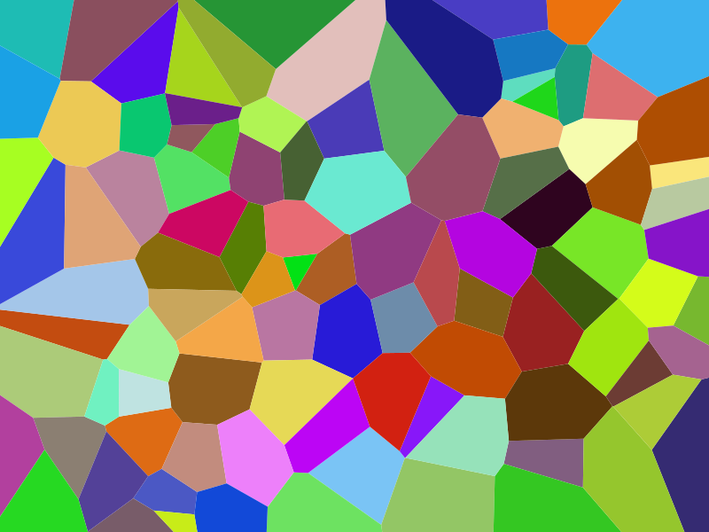

= Voronoi diagram generator

This program generates random Voronoi diagrams.

It uses Fortune's Algorithm. As I recall, I translated Fortune's original code from C into OCaml.

You'll need [OPAM](https://opam.ocaml.org/) installed in order to run this.

After installing OPAM, you should be able to build and run thus:

    ./setup.sh && ./make && ./test

The default random seed is 0, which gives you the same diagram every time. To change it, you can specify a seed on the command line:

    ./test 300

This uses 300 as the seed, giving you a different diagram.

Here is an example of the output for seed 0:

